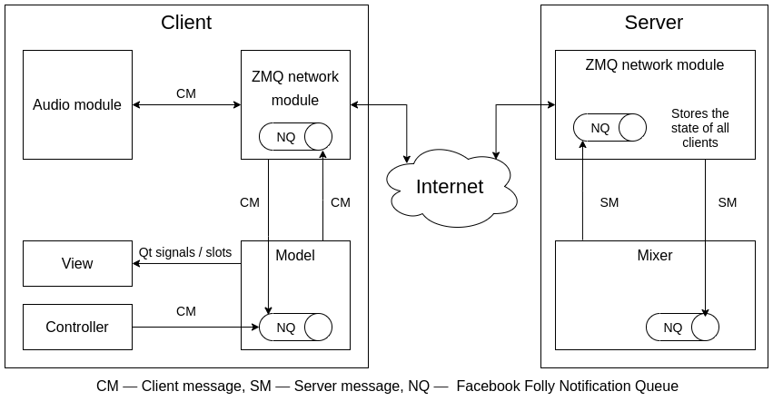

# PosiPhone

This is a position-based conference call system

## Features

* GUI was implemented using [Qt](https://www.qt.io/)
* [Qt Multimedia](https://doc.qt.io/qt-5/qtmultimedia-module.html) module was used for Audio recording & playing
* [ZMQ](https://zeromq.org) + [Boost](https://www.boost.org/) libraries is for Network modules
* Multithreading by using `std::thread` and [Facebook Folly](https://github.com/facebook/folly)
* Audio mixer was written using [AudioFile library](https://github.com/adamstark/AudioFile)

## How to build PosiPhone

1. Clone this repo
2. Run `build.sh` script as root to install necessary libs
3. Enjoy

## Docker image

Use those commands to run the server in Docker:
```shell
sudo docker build -t posiphone-server .
sudo docker run -it posiphone-server
```

## Demo


## Project structure


